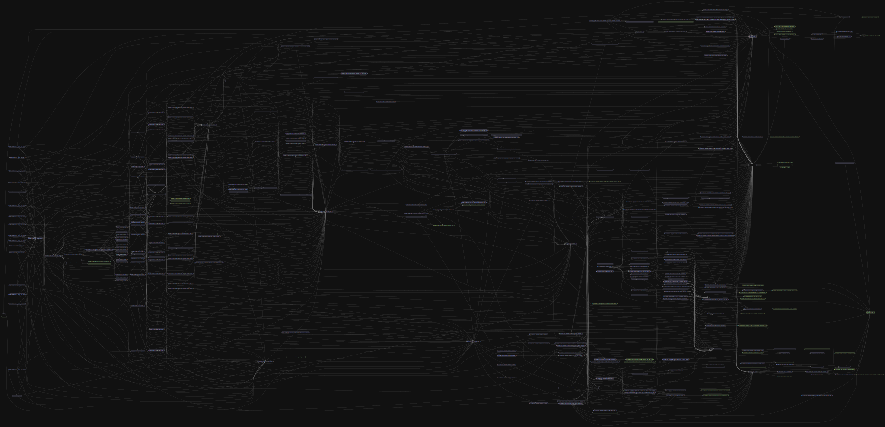

# HD Derivations

## Table of Contents
- [Overview](#overview)
- [Features](#features)
- [Installation](#installation)
- [Usage](#how-to-use)
  - [Importing](#1-import-utilities)
  - [Getting a Network Instance](#2-get-network-instance-by)
  - [Derivation Methods](#3-use-the-instance-methods)
- [Folder Structure](#folder-structure)
- [Contributing](#contributing)
- [Supported Networks](#supported-networks)
- [Quality Criteria](#quality-criteria)

<a id="overview"></a>
## Overview

hd-derivations is a powerful and flexible hierarchical deterministic (HD) key derivation library designed for seamless multi-chain support. It allows users to derive private keys, public keys, and addresses from mnemonics or private keys, ensuring compatibility with various blockchain networks. The library is built to handle standard and non-standard derivation paths, making it ideal for restoring accounts from custom wallet setups.

With support for multiple key types, derivation schemes, and other network specific configs, `hd-derivations` is a reliable solution for developers working with Bitcoin, Ethereum-compatible chains, Cardano, and more. Whether you are generating wallets, recovering accounts, or working with advanced key management, this package simplifies the process while maintaining security and flexibility.

<a id="features"></a>
## Key Features

- **Mnemonic-based derivation** – Generate private keys, public keys, and addresses from a mnemonic phrase.
- **Private key-based derivation** – Derive public keys and addresses directly from a private key.
- **Batch derivation** – Derive multiple key sets from a mnemonic in a single operation.
- **Mnemonic verification** – Verify if a private key was derived from a given mnemonic.
- **Custom derivation paths** – Support non-standard paths for wallet recovery and custom setups.
- **Multi-network compatibility** – Works with Bitcoin, EVM chains (Ethereum, Binance Smart Chain, etc.), Cardano, and more.
- **Extensible & secure** – Designed for easy integration with blockchain clients while maintaining strong security principles.

<a id="installation"></a>
## Installation

```bash
yarn add @morethanwallet/hd-derivations
```

<a id="how-to-use"></a>
## How to Use

### 1. Import Utilities

- Node JS:

```ts
import { getNetwork } from "@morethanwallet/hd-derivations/node";
```

- Browser:

```ts
import { getNetwork } from "@morethanwallet/hd-derivations/browser";
```

### 2. Create Network

You can get a network instance by:

- Manually passing the required parameters:

```ts
const network = getNetwork({
  network: "bch",
  mnemonic: "drill exotic title fall ivory boy praise unfold search foil surge tip",
  derivationConfig: {
    derivationType: "bchCashAddr",
    networkPurpose: "mainnet",
    prefixConfig: {
      messagePrefix: "\x18Bitcoin Signed Message:\n",
      bech32: "bc",
      bip32: {
        public: 0x0488b21e,
        private: 0x0488ade4,
      },
      pubKeyHash: 0x00,
      scriptHash: 0x05,
      wif: 0x80,
    },
  },
});
```

- Using the default parameters:

```ts
import { DEFAULT_BCH_INSTANCE_PARAMETERS, getNetwork } from "@morethanwallet/hd-derivations/node"; // Or "@morethanwallet/hd-derivations/browser"

const network = getNetwork(DEFAULT_BCH_INSTANCE_PARAMETERS);
```

### 3. Network Methods

The network instance has the following methods:

- `deriveItemFromMnemonic` - Derive a single item from a mnemonic phrase.
- `deriveItemsBatchFromMnemonic` - Derive multiple items from a mnemonic phrase.
- `doesPKBelongToMnemonic` - Check if a private key belongs to a mnemonic phrase.
- `getCredentialFromPK` - Get a credential from a private key.

#### Examples

- `deriveItemFromMnemonic`

  ```ts
  const item = network.deriveItemFromMnemonic({ derivationPath: "m/44'/145'/0'/0/0" });
  ```

  **Output**:

  ```ts
  {
    privateKey: 'L5aNkaUVgbf9amcZaJxxkXBC6X9msHUGix6G1UiHS3seDADj3u7T',
    publicKey: '030c98a8878c769710d0a986e824659b56fdb11a22ff3e8b4c3061944932fc5bcd',
    address: 'bitcoincash:qpflutgnl6xg988yxaqv4y4jcef3x663gyejnjfxte',
    derivationPath: "m/44'/145'/0'/0/0"
  }
  ```

- `getCredentialFromPK`

  ```ts
  const credential = network.getCredentialFromPK({
    privateKey: "Kysn6FCsYUwSwYVdUD4c6kdntJeZCZWpPYPj6LjEV2pDPyWNFhjX",
  });
  ```

  **Output**:

  ```ts
  {
    privateKey: 'Kysn6FCsYUwSwYVdUD4c6kdntJeZCZWpPYPj6LjEV2pDPyWNFhjX',
    publicKey: '0333d222cc1fd501e74b6d64cb1e4dd85bbcb28d9ce3fd6a30133f5aa6211a8fc3',
    address: 'bitcoincash:qrchjgvn4keqa6qwesjvywyj2fy46x2ex556xmy82u'
  }
  ```

- `deriveItemsBatchFromMnemonic`

  ```ts
  const items = network.deriveItemsBatchFromMnemonic({
    derivationPathPrefix: "m/44'/145'/0'/0",
    indexLookupFrom: 0,
    indexLookupTo: 2,
  });
  ```

  **Output**:

  ```ts
  [
    {
      privateKey: "L5SA8xakaywY1Sham7js3Uj27kTP3voCghRZa8JdH5CuynwY89jM",
      publicKey: "02766182fa20d62a27560d36516753d708cc5a47ff67b40d1967f2ea655c97f37b",
      address: "bitcoincash:qpdlt7ra4edruc59yvkkqavgxuae2z73acv5p83mxh",
      derivationPath: "m/44'/145'/0'/0/0",
    },
    {
      privateKey: "L3dcBt5oH4Q5fLUgi3Sfr9S4dLVMGKSa42wkMqBeV7KECc4ThPJz",
      publicKey: "0263144016657a7fe9c08d10e55e7fe08648a17ced5d1aa7a7e1f94ad122993245",
      address: "bitcoincash:qq37wqs963g6dey6pkczd7g2jgpmrkmpmgcqp9knd5",
      derivationPath: "m/44'/145'/0'/0/1",
    },
  ];
  ```

- `doesPKBelongToMnemonic`

  ```ts
  const doesPKBelongToMnemonic = network.doesPKBelongToMnemonic({
    privateKey: "KxUYbZfVLLEFehzKcNXJSJvmBjbYswf9ZEsasfH5vFbdvvwS1F31",
    derivationPathPrefix: "m/44'/145'",
    indexLookupFrom: 0,
    indexLookupTo: 2,
  });
  ```

  **Output**:

  ```ts
  false;
  ```

#### Parameters

Networks parameters are defined in the [`instance-parameters.type.ts`](src/modules/network/libs/types/instance-parameters.type.ts) file.

> **Polkadot:** You can find the list of `ss58` formats in the [ss 58 registry](https://github.com/paritytech/ss58-registry/blob/main/ss58-registry.json).

Networks methods parameters are defined in the [`abstract-network.type.ts`](src/modules/network/libs/types/abstract-network.type.ts) file.

<a id="folder-structure"></a>
## Folder Structure

1. The `libs` directory contains the reusable utilities throughout the package and it consists of the following entities:

- `constants`
- `enums`
- `exceptions`
- `helpers` - contains helper functions with more complex and less abstract logic that depends on other parts of the package
- `modules` - contains separate entities
- `types`
- `utils` - contains simple utilities that don't depend on any part of the package

> **If the needed entity is local for some directory the `libs` structure is also duplicated in that directory**

2. The `modules` directory contains the main package entities

<a id="contributing"></a>
## Contributing

### How to add a new Network

> **Adapt or reuse any existing module if possible**

- Implement curve logic in the [`curves`](src/libs/modules//curves/curves.ts)
- Implement credentials logic in [`key-derivation`](src/libs/modules/key-derivation/index.ts)
- Implement address logic in [`address`](src/libs/modules/address/index.ts)
- Add the network derivation types to [`DerivationTypeUnion`](src/libs/types/derivation/derivation-type-union.type.ts)
- Add the network to [`NetworkTypeMap`](src/modules/network/libs/types/network-type-map.type.ts)
- Adapt [`AbstractNetwork`](src/modules/network/libs/types/abstract-network.type.ts) to support the network
- Adapt [`ConstructorParameters`](src/modules/network/libs/types/constructor-parameters.type.ts) for the network
- Implement derivation handlers in `src/modules/network/{network}/libs/helpers/get-derivation-handlers.helper.ts`
- Add `derivationHandlers` field to the network class
- Implement `deriveItemFromMnemonic`, `getCredentialFromPK`, `deriveItemsBatchFromMnemonic` and `doesPKBelongToMnemonic` methods
- Extend the [`getNetwork`](src/modules/network/get-network/get-network.ts) function

<a id="supported-networks"></a>
## Supported Networks

- `Cardano`
- `Aptos`
- `Avalanche X`
- `Avalanche P`
- `Bitcoin Cash`
- `BNB Beacon Chain`
- `Bitcoin`
- `Dogecoin`
- `Polkadot`
- `EVM`
- `Litecoin`
- `Solana`
- `Sui`
- `TON`
- `Tron`
- `XRP`
- `Zcash`

<a id="quality-criteria"></a>
## Quality Criteria

1. For full guidelines, see [`quality-criteria.md`](quality-criteria.md).

2. Make sure you're not causing any circular dependencies and confused structure in the dependency graph:
   
